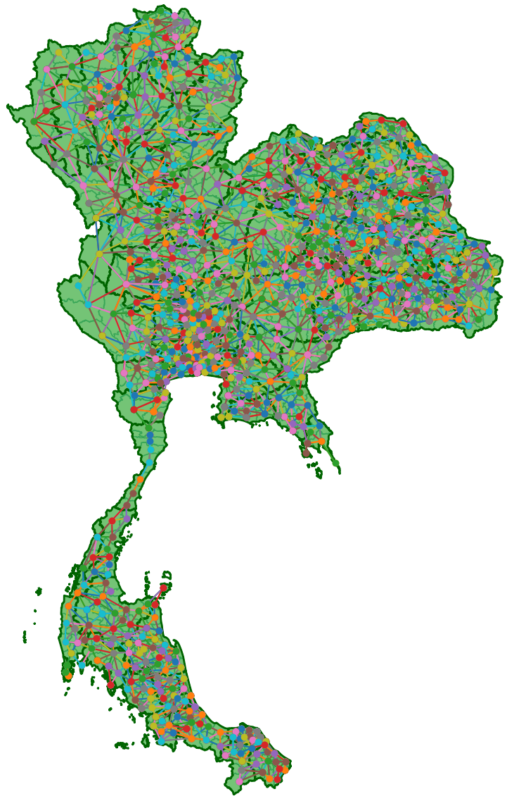

# Adjacency Matrices for Thailand Districts: A Comprehensive Dataset

<p align="center">
  
</p>
## Abstract

This study presents a comprehensive dataset of adjacency and distance matrices for all 928 districts in Thailand, a critical resource for enhancing spatial analysis and supporting effective urban and regional planning. By detailing connections between districts through boundary proximity and precise distance measurements, the dataset facilitates advanced applications in Geographic Information Systems (GIS), network analysis, and strategic planning. Key applications include optimizing transportation routes, improving resource allocation, and supporting policy-making decisions. Moreover, we demonstrate the dataset's utility through centrality metrics—degree, eigenvector, and Katz centrality—which identify districts crucial for regional connectivity and economic vitality. This analysis not only highlights important hubs but also aids in understanding the broader economic and geographical landscape of Thailand. The findings from this dataset are expected to significantly enhance national connectivity and provide a robust foundation for future development strategies. This work underscores the importance of precise spatial data in urban planning and the potential of network theory in public administration and infrastructure development.


```bibtex
@article{GrowthPoleAnalysis,
  author = {Tepsan, Worawit},
  doi = {00.0000/00000},
  journal = {Journal Title},
  month = sep,
  number = {1},
  pages = {1--6},
  title = {{{Adjacency Matrices for Thailand Districts: A Comprehensive Dataset}},
  volume = {1},
  year = {2024}
}
