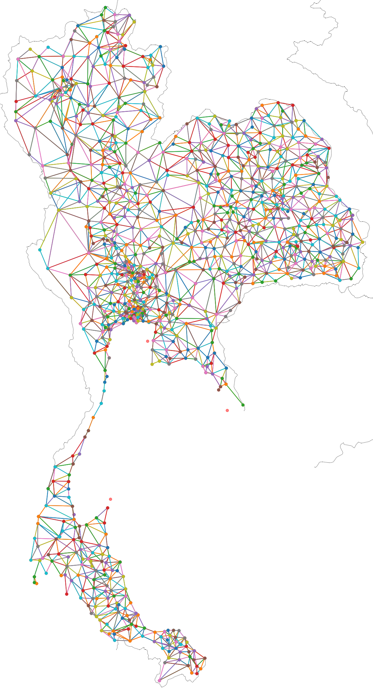

# Spatial Connectivity of Districts in Thailand: A Comprehensive Dataset of District Adjacency and Distance Matrices

<p align="center">
  
</p>
## Abstract

This study introduces a geospatial dataset comprising adjacency and distance matrices for Thailand's 77 provinces and 928 districts. Designed to enhance spatial analysis and support urban and regional planning initiatives, this dataset maps connections based on boundary proximity and precise distance measurements. It serves as a valuable tool for Geographic Information Systems (GIS), network analysis, and strategic planning efforts.

```bibtex
@article{AdjacencyDistrict,
  author = {Tepsan, Worawit},
  doi = {00.0000/00000},
  journal = {Journal Title},
  month = sep,
  number = {1},
  pages = {1--6},
  title = {{{Spatial Connectivity of Districts in Thailand: A Comprehensive Dataset of District Adjacency and Distance Matrices}},
  volume = {1},
  year = {2024}
}
