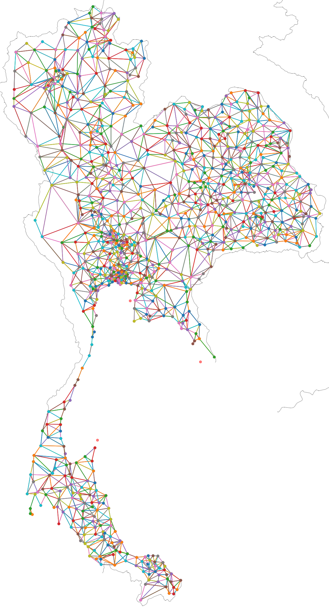

# Identifying Vital Hubs in Transportation Network Using Multiple Perspectives of Complex Networks

<p align="center">
  
</p>

## Abstract 
Hubs are strategic locations that function as central nodes within clusters of cities, playing a pivotal role in the distribution of goods, services, and connectivity. Identifying these vital hubs—through analyzing influential locations within transportation networks—is essential for effective urban planning, logistics optimization, and enhancing infrastructure resilience. This task becomes even more crucial in developing and less-developed countries, where such hubs can significantly accelerate urban growth and drive economic development. However, existing hub identification approaches face notable limitations. Traditional centrality measures often yield low variance in node scores, making it difficult to distinguish truly influential nodes. Moreover, these methods typically rely solely on either local metrics or global network structures, limiting their effectiveness. To address these challenges, we propose a novel method called Hybrid Community-based Gravity Centrality (HCGC), which integrates local influence measures, community detection, and gravity-based modeling to more effectively identify influential nodes in complex networks. Through extensive experiments, we demonstrate that HCGC consistently outperforms existing methods in terms of spreading ability across varying truncation radii. To further validate our approach, we introduce ThaiNet, a newly constructed real-world transportation network dataset. The results show that HCGC not only preserves the strengths of traditional local approaches but also captures broader structural patterns, making it a powerful and practical tool for real-world network analysis.

### Keywords
transportation networks; connectivity; network analysis; hub identification; influential nodes; geospatial dataset;

## Data Availability

The datasets collected, compiled, and analyzed in this study, along with the code used for generating the data can be accessed through this GitHub repository.

Additionally, the foundational public datasets used as the basis for generating the core dataset for this study, as well as for model evaluation, are listed below:

1. **Thailand District Boundaries**: This dataset is available from the Office of the National Digital Economy and Society Commission and was originally provided by the Geo-Informatics and Space Technology Development Agency, Thailand. For more information, visit the [https://opendata.onde.go.th/dataset/8-administrative-boundaries](https://opendata.onde.go.th/dataset/8-administrative-boundaries), or access a copy from our GitHub repository:  [Github Folder](https://github.com/wtepsan/Adjacency-and-Distance-Matrix-of-Thailand/tree/main/data_foundation_public_source/boundary)
2. **Thailand District Lists**: Available at [https://data.go.th/dataset/view_district](https://data.go.th/dataset/view_district) or [https://data.go.th/th/dataset/item_f9a9a9dd-d23d-4b86-89ae-e34820d4f3dc](https://data.go.th/th/dataset/item_f9a9a9dd-d23d-4b86-89ae-e34820d4f3dc).
3. **Network Datasets for Model Evaluation**: Publicly available datasets used for evaluation and comparison include [NETWORKREPOSITORY](https://networkrepository.com/networks.php) and [KONECT](http://konect.cc/networks/).

```bibtex
@article{Tepsan2025IdentifyingHubs,
  author    = {Tepsan, Worawit and Phaphuangwittayakul, Aniwat and Sokantika, Saronsad and Harnpornchai, Napat},
  title     = {Identifying Hubs Through Influential Nodes in Transportation Network by Using a Gravity Centrality Approach},
  journal   = {Algorithms},
  year      = {2025},
  volume    = {18},
  number    = {6},
  pages     = {356},
  doi       = {10.3390/a18060356}
}
}
